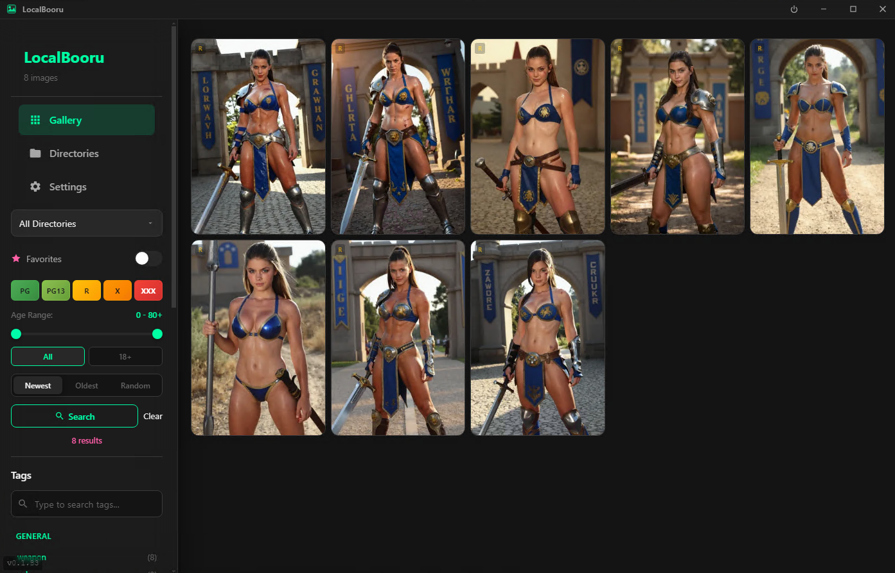
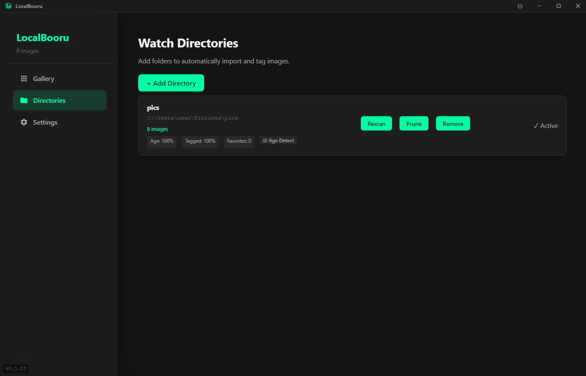
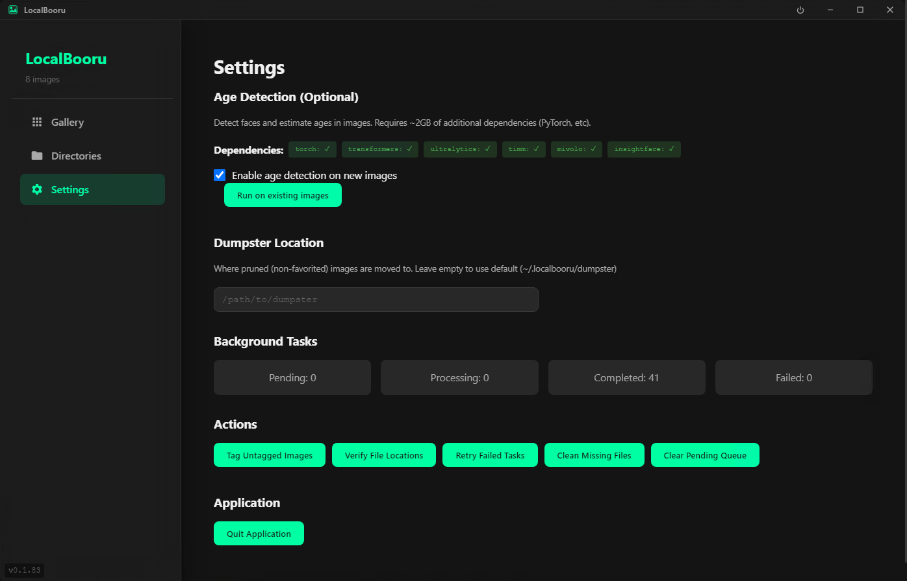

# LocalBooru

A local image library with automatic AI tagging, designed for organizing and browsing large image collections.

## Screenshots


*Gallery with masonry layout, rating badges, and tag filtering*


*Manage watched folders with progress tracking*


*Age detection with dependency management*

## Features

### Automatic AI Tagging
- **Booru-style tags** - Automatically tags images with character, artist, copyright, and general tags using AI models
- **Face detection** - Detects faces in images and estimates age
- **Content rating** - Automatically classifies images by rating (PG, PG13, R, X, XXX)

### Smart Organization
- **Watch directories** - Point LocalBooru at your image folders and it automatically imports and tags new images
- **Tag-based search** - Find images instantly using tag combinations
- **Favorites** - Mark your best images and filter to show only favorites
- **Pruning** - Clean up non-favorited images by moving them to a dumpster folder

### Modern Interface
- **Masonry grid** - Beautiful responsive gallery layout
- **Lightbox viewer** - Full-screen image viewing with keyboard navigation
- **Dark theme** - Easy on the eyes for extended browsing sessions
- **Filter sidebar** - Filter by tags, ratings, age range, and directories

### Flexible Access
- **Desktop app** - Native Electron application for Windows, macOS, and Linux
- **Web browser** - Access your library from any browser at `http://localhost:8787`
- **System tray** - Runs quietly in the background, always ready

### Auto Updates
- Automatically checks for new versions
- One-click update installation

## Installation

### Download
Get the latest release for your platform from the [Releases](https://github.com/DonutsDelivery/LocalBooru/releases) page:

- **Windows**: `LocalBooru-Setup-x.x.x.exe` (installer) or `LocalBooru-Portable-x.x.x.exe`
- **macOS**: `LocalBooru-x.x.x-arm64.dmg` (Apple Silicon) or `LocalBooru-x.x.x-x64.dmg` (Intel)
- **Linux**: `LocalBooru-x.x.x.AppImage`, `.deb`, or `.rpm`

### Requirements
- **Windows/macOS**: No additional requirements
- **Linux**: Python 3.10+ with pip (for the tagging backend)

## Getting Started

1. **Launch LocalBooru** - The app starts with an empty library
2. **Add a directory** - Go to "Directories" and click "Add Directory" to select a folder containing images
3. **Wait for processing** - LocalBooru will scan and tag your images in the background
4. **Browse and enjoy** - Use the gallery to browse, search, and favorite your images

## Usage Tips

### Searching
- Click tags in the sidebar to filter images
- Use the search box to find specific tags
- Combine multiple tags to narrow results

### Keyboard Shortcuts (Lightbox)
- `←` `→` - Navigate between images
- `Escape` - Close lightbox
- `F` - Toggle favorite

### Filtering
- **Ratings** - Toggle rating buttons to show/hide content levels
- **Age range** - Filter by detected face age
- **Favorites only** - Show only your favorited images
- **Directory** - Filter to a specific watched folder

### Pruning
Keep your collection clean by pruning directories:
1. Go through images and favorite the ones you want to keep
2. Go to "Directories" and click "Prune" on a folder
3. Non-favorited images are moved to the dumpster folder

## Development

### Prerequisites
- Node.js 20+
- Python 3.10+
- pip

### Setup
```bash
# Clone the repository
git clone https://github.com/DonutsDelivery/LocalBooru.git
cd LocalBooru

# Install Node dependencies
npm install

# Install Python dependencies
pip install -r requirements.txt

# Build the frontend
npm run build:frontend

# Run in development mode
npm run dev
```

### Building
```bash
# Build for current platform
npm run build

# Build for specific platforms
npm run build:linux
npm run build:win
```

## Tech Stack

- **Frontend**: React + Vite
- **Desktop**: Electron
- **Backend**: Python FastAPI
- **Database**: SQLite
- **AI/ML**: PyTorch, Transformers, YOLO

## License

MIT License - See [LICENSE](LICENSE) for details.

## Credits

Built with love for image collectors everywhere.
